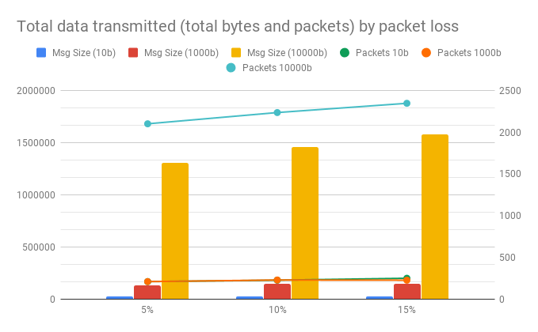

# tcc-coap-testing
Project for basic testing of the CoAP protocol for data transmission

---
## Results
Tests were done by monitoring the loopback interface on the Raspberry Pi.
Tests could not be performed on Windows due to a missing implementation regarding IPv6 on Windows.  
Both confirmable and non-confirmable messages were tested. The results show how many bytes were
transmitted between the server and client on a simple POST request.

| Message Size | Size Confirmable | Size Non Confirmable |
|:---:|:---:|:---:|
0| 137| 137
1| 139| 139
10| 148| 148
100| 238| 238
1000| 1138| 1138
10000| 11440‬| 11440

The overhead for empty messages appears to be 137 bytes, including the URI.
Notably, both messages have the same size. This is probably due to the fact that whether the server
responds or not is up to the resource implementation, so even if the message is non confirmable the
server may still answer. This will have a difference on poor network conditions, which are not tested
here.

## Results with packet loss

Tests with packets loss were performed by using iptables' statistic module and dropping packets randomly, both on
`INPUT` and `OUTPUT`. Non confirmable messages were not tested in this case as they would obviously only be discarded.
To avoid chances, 100 messages were sent on each attempt, with a 0.1 second delay between each one, 
with sizes of 10, 1000 and 10000 bytes each, as to break the message into multiple packets. 

### Results by total bytes transmitted

The amount of data transmitted in total bytes are in the table below.

Packet Loss | Msg Size (10b) | Msg Size (1000b) |Msg Size (10000b) |
|:---:|:---:|:---:|:---:|
 5% | 20375 | 126305 | 1303222 |
10% | 22500 | 147490 | 1456192 |
15% | 25375 | 145260 | 1576714 |

### Results by total packets transmitted

Packet Loss | Packets 10b | Packets 1000b | Packets 10000b |
|:---:|:---:|:---:|:---:|
 5% | 207 | 207 | 2101 |
10% | 224 | 226 | 2236 |
15% | 247 | 224 | 2347 |

---

The data in the tables above is displayed in the following graph.

CoAP appears to handle packet loss surprisingly well, adding little overhead and still managing to deliver all
message.

## Conclusion
There overhead using UDP is considerably reduced, as it doesn't increase too much on poor network conditions. 
Even then, non confirmable messages should not be used due to the fire and forget nature.  
CoAP appears to be less supported than MQTT and slightly harder to use, at least for the Python
implementations. There is lacking Windows support (due to a missing implementation on the `asyncio` package) and
during testing a few error messages appeared on the server's console, although they didn't seem to impact the
message exchange. This should be taken into account.
